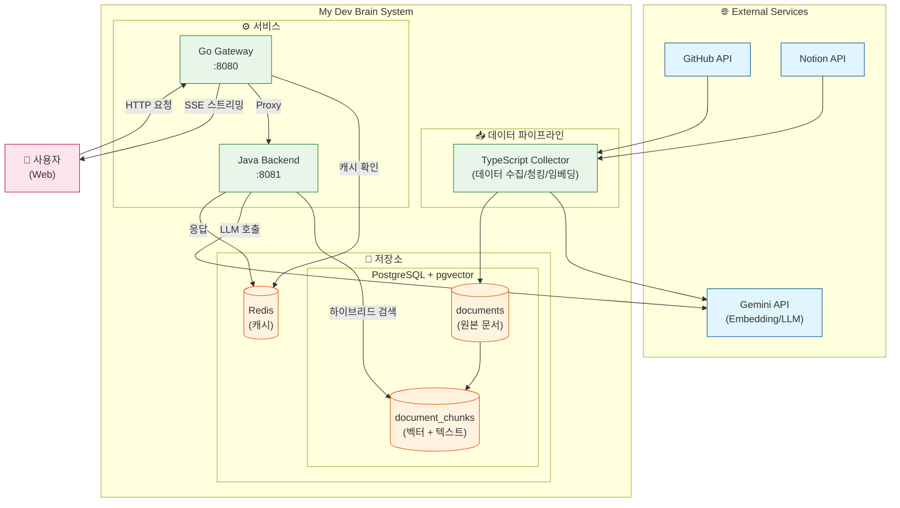
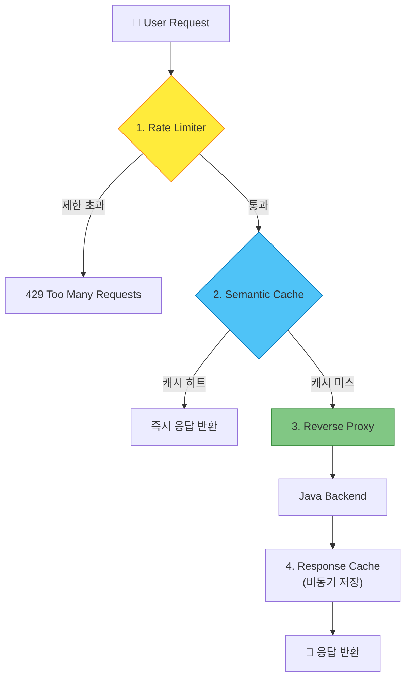
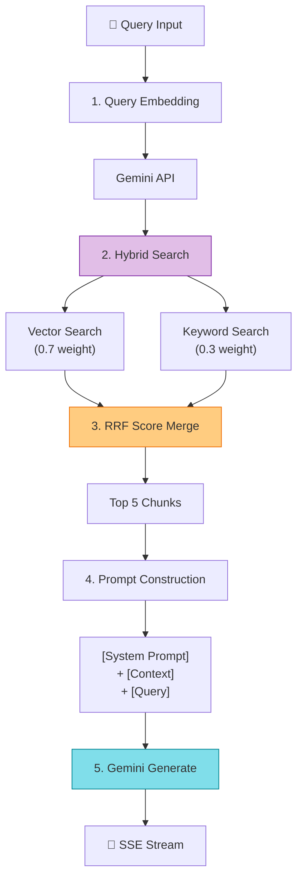
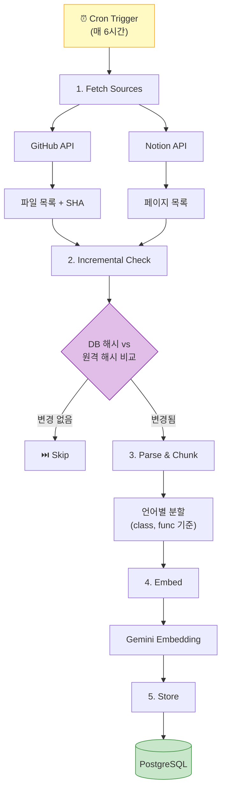
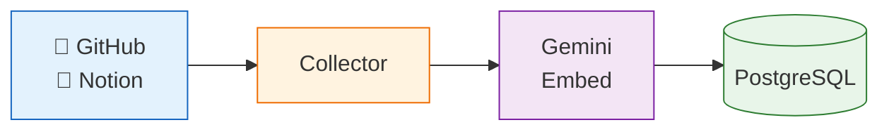
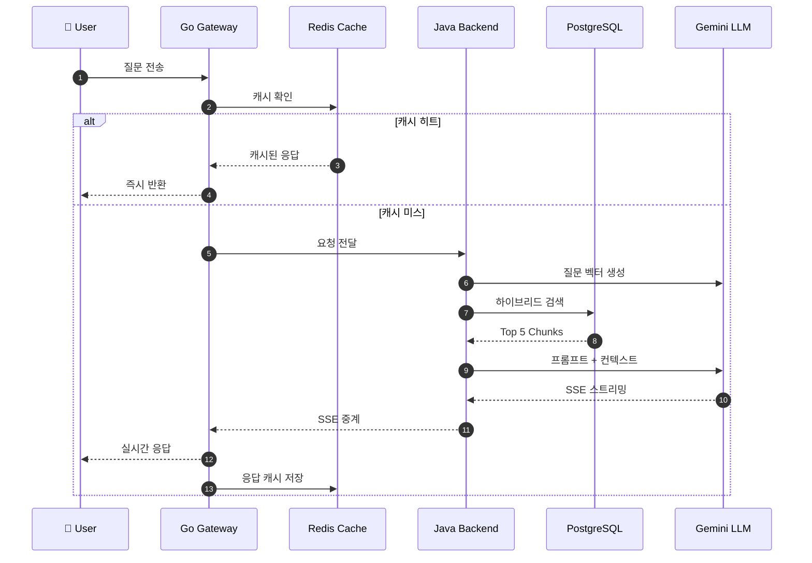
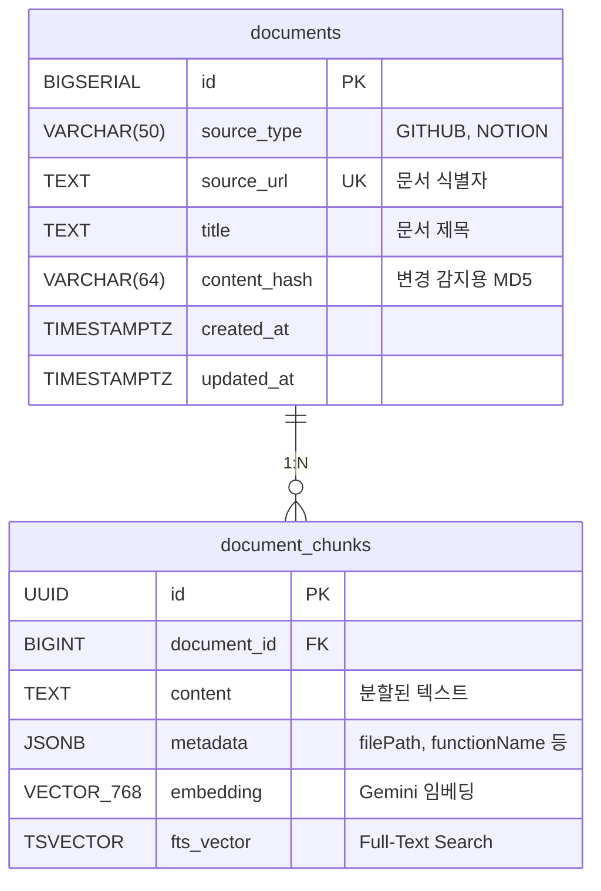

# My Dev Brain - 아키텍처 설계 문서

## 1. 시스템 전체 구조



---

## 2. 서비스별 역할

### 2.1 Go Gateway (게이트웨이)

| 항목 | 내용 |
|------|------|
| **포트** | 8080 |
| **역할** | 모든 요청의 진입점 |
| **핵심 기능** | 의미 기반 캐시, Rate Limiting, SSE 프록시 |



### 2.2 Java Backend (백엔드)

| 항목 | 내용 |
|------|------|
| **포트** | 8081 |
| **역할** | RAG 비즈니스 로직 |
| **핵심 기능** | 하이브리드 검색, Gemini API 연동, SSE 스트리밍 |



### 2.3 TypeScript Collector (수집기)

| 항목 | 내용 |
|------|------|
| **실행** | Cron 또는 수동 |
| **역할** | 외부 소스에서 데이터 수집 |
| **핵심 기능** | 코드 청킹, 임베딩 생성, 증분 동기화 |



---

## 3. 데이터 흐름

### 3.1 데이터 수집 흐름 (Write Path)



**처리 단계:**
1. Collector가 GitHub API로 파일 가져오기
2. 언어별 규칙으로 코드 청킹
3. 각 청크에 메타데이터 주입 (파일 경로, 함수명)
4. Gemini API로 768차원 벡터 생성
5. documents + document_chunks 테이블에 저장

### 3.2 질문 응답 흐름 (Read Path)



---

## 4. 데이터베이스 ERD



### 인덱스 구성

| 인덱스 타입 | 대상 컬럼 | 용도 |
|-------------|-----------|------|
| **HNSW** | `embedding` | 벡터 유사도 검색 |
| **GIN** | `metadata` | JSON 필터링 |
| **GIN** | `fts_vector` | 키워드 검색 |

---

## 5. API 엔드포인트

### 5.1 Gateway (Go) - 외부 노출

| Method | Path | 설명 |
|--------|------|------|
| GET | `/health` | 헬스체크 |
| POST | `/api/chat` | 채팅 질문 (SSE 응답) |
| GET | `/api/chat/stream` | 스트리밍 채팅 |

### 5.2 Backend (Java) - 내부 전용

| Method | Path | 설명 |
|--------|------|------|
| GET | `/health` | 헬스체크 |
| POST | `/api/chat` | RAG 채팅 처리 |
| GET | `/api/chat/stream` | SSE 스트리밍 |
| POST | `/api/search` | 하이브리드 검색 (디버그용) |
| POST | `/api/embed` | 임베딩 생성 (테스트용) |

---

## 6. 하이브리드 검색 알고리즘

### 6.1 RRF (Reciprocal Rank Fusion)

```
최종 점수 = Σ 1 / (k + rank_i)

k = 60 (상수)
rank_i = 해당 검색 결과에서의 순위
```

### 6.2 가중치 적용

```
hybrid_score = (vector_score × 0.7) + (keyword_score × 0.3)
```

### 6.3 예시

```
질문: "Spring Boot에서 JWT 인증 구현 방법"

벡터 검색 결과:
  1. JwtAuthenticationFilter.java (score: 0.92)
  2. SecurityConfig.java (score: 0.88)
  3. TokenProvider.java (score: 0.85)

키워드 검색 결과:
  1. AuthController.java (score: 0.75, "JWT" 키워드 매칭)
  2. JwtAuthenticationFilter.java (score: 0.70)
  3. README.md (score: 0.65)

최종 결과 (RRF 병합 후):
  1. JwtAuthenticationFilter.java (양쪽에서 상위)
  2. SecurityConfig.java
  3. TokenProvider.java
  4. AuthController.java
  5. README.md
```

---

## 7. 시스템 프롬프트

```
당신은 12년 차 백엔드 개발자의 기술 도우미입니다.

## 규칙
1. 아래 제공된 [Context] 내용을 기반으로만 답변하세요.
2. [Context]에 없는 내용은 지어내지 말고 "해당 정보를 찾을 수 없습니다"라고 답하세요.
3. 답변에는 코드 예시를 적극적으로 포함하세요.
4. 코드 출처(파일 경로)를 명시하세요.

## Context
{검색된 문서 청크들}

## 질문
{사용자 질문}
```

---

## 8. 배포 구성

### 8.1 Docker Compose 구성

```yaml
services:
  gateway:
    build: ./gateway
    ports: ["8080:8080"]
    depends_on: [backend, redis]
    
  backend:
    build: ./backend
    ports: ["8081:8081"]
    depends_on: [postgres]
    
  collector:
    build: ./collector
    depends_on: [postgres]
    # Cron으로 실행 또는 docker-compose run collector
    
  postgres:
    image: pgvector/pgvector:pg16
    ports: ["5432:5432"]
    volumes: ["./infrastructure/postgres/init.sql:/docker-entrypoint-initdb.d/init.sql"]
    
  redis:
    image: redis:7-alpine
    ports: ["6379:6379"]
```

### 8.2 환경별 설정

| 환경 | Gateway | Backend | DB |
|------|---------|---------|-----|
| Local | localhost:8080 | localhost:8081 | localhost:5432 |
| Docker | gateway:8080 | backend:8081 | postgres:5432 |
| Production | (Load Balancer) | (Internal) | (Managed DB) |

---

## 9. 확장 고려사항

### 9.1 성능 최적화
- [ ] 벡터 인덱스 파라미터 튜닝 (m, ef_construction)
- [ ] 청크 크기 최적화 (현재 권장: 500-1000 토큰)
- [ ] 캐시 TTL 조정

### 9.2 기능 확장
- [ ] 멀티 테넌트 지원
- [ ] 사용자별 지식 베이스
- [ ] 대화 히스토리 저장
- [ ] 피드백 기반 검색 개선

### 9.3 모니터링
- [ ] Prometheus 메트릭
- [ ] Grafana 대시보드
- [ ] 분산 트레이싱 (Jaeger)

