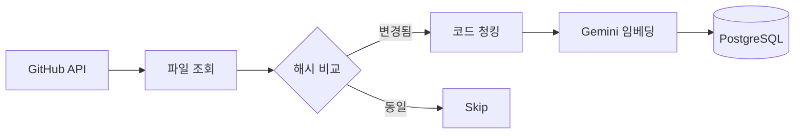

# 📥 My Dev Brain - Collector

GitHub 레포지토리에서 코드를 수집하여 벡터 데이터베이스에 저장하는 TypeScript 수집기입니다.

## 🚀 주요 기능

- **GitHub 연동**: 레포지토리에서 코드 파일 자동 수집
- **스마트 청킹**: 언어별 구문 분석 기반 코드 분할
- **임베딩 생성**: Google Gemini API로 768차원 벡터 생성 (텍스트를 숫자 배열로 변환)
- **증분 동기화**: 변경된 파일만 처리 (해시 비교)

## 💡 핵심 개념

### Collector의 역할

Collector는 **"데이터 수집 + 검색 가능한 형태로 변환"**하는 역할입니다.

```
[GitHub 코드] → [Collector] → [검색 가능한 벡터 DB]
```

나중에 사용자가 "JWT 인증 어떻게 구현하지?"라고 질문하면, 백엔드가 관련된 코드 조각을 찾아서 AI에게 전달합니다. 이를 위해 **코드를 "검색 가능한 형태"로 미리 준비**해야 하는데, 그 준비 작업을 Collector가 담당합니다.

### 청킹(Chunking)이란?

**코드를 의미 있는 단위로 분할하는 작업**입니다.

1000줄짜리 파일을 통째로 저장하면 검색 정확도가 떨어집니다. 예를 들어:

```typescript
// 원본 파일 (auth.ts) - 100줄
export class AuthService {
  validateToken() { ... }  // 50줄
  refreshToken() { ... }   // 30줄
  logout() { ... }         // 20줄
}
```

이를 함수 단위로 분할하면:
- 청크1: `validateToken` 함수
- 청크2: `refreshToken` 함수  
- 청크3: `logout` 함수

"토큰 검증"을 검색할 때 `validateToken` 함수만 정확히 찾아올 수 있습니다.

### 임베딩(Embedding)이란?

**텍스트를 숫자 배열(벡터)로 변환하는 작업**입니다.

컴퓨터는 "JWT 검증"과 "토큰 유효성 확인"이 비슷한 의미라는 걸 모릅니다. 하지만 임베딩하면 **의미가 비슷한 텍스트는 비슷한 숫자 배열**이 됩니다:

```
"JWT 검증"      → [0.12, 0.45, -0.23, ...] (768개 숫자)
"토큰 유효성 확인" → [0.11, 0.44, -0.22, ...] (비슷한 벡터!)
"오늘 날씨"      → [0.89, -0.12, 0.67, ...] (완전 다른 벡터)
```

사용자가 "토큰 검증 방법"을 질문하면, 이 벡터들 간의 거리를 계산해서 가장 가까운(=의미가 비슷한) 코드 청크를 찾습니다. 이것이 **RAG(Retrieval-Augmented Generation)**의 핵심입니다.

## 📁 프로젝트 구조

```
collector/
├── src/
│   ├── index.ts              # 진입점
│   ├── config/
│   │   └── env.ts            # 환경 변수 검증
│   ├── db/
│   │   ├── client.ts         # PostgreSQL 연결
│   │   ├── schema.ts         # Drizzle 스키마
│   │   └── repository.ts     # CRUD 함수
│   ├── sources/
│   │   └── github/
│   │       └── client.ts     # GitHub API 클라이언트
│   ├── chunking/
│   │   └── splitter.ts       # 코드 분할 로직
│   ├── embedding/
│   │   └── gemini.ts         # Gemini 임베딩
│   └── sync/
│       └── incremental.ts    # 증분 동기화
├── package.json
├── tsconfig.json
└── README.md
```

## 🛠️ 설치 및 실행

### 1. 의존성 설치

```bash
cd collector
pnpm install
```

### 2. 환경 변수 설정

프로젝트 루트의 `.env` 파일에 다음 값들이 설정되어 있어야 합니다:

```env
# 필수
DB_HOST=localhost
DB_PORT=5432
DB_USER=postgres
DB_PASSWORD=your_password
DB_NAME=dev_brain

GITHUB_TOKEN=ghp_your_token
GITHUB_REPOS=owner/repo1,owner/repo2

GOOGLE_API_KEY=your_gemini_api_key

# 선택
CHUNK_SIZE=1000
CHUNK_OVERLAP=200
```

### 3. 실행

```bash
# 개발 모드 (watch)
pnpm dev

# 한 번 실행
pnpm sync

# 빌드
pnpm build
```

## 📊 지원 언어

| 언어 | 확장자 | 분할 기준 |
|------|--------|-----------|
| TypeScript | `.ts`, `.tsx` | class, function, const |
| JavaScript | `.js`, `.jsx` | class, function, const |
| Java | `.java` | class, method |
| Go | `.go` | func, type |
| Python | `.py` | class, def |
| Markdown | `.md` | 제목 (##, ###) |

## 🔧 동작 원리



1. **GitHub API**로 레포지토리 파일 목록 조회
2. 기존 DB의 **해시값과 비교**하여 변경 감지
3. 변경된 파일만 **언어별 규칙으로 청킹**
4. 각 청크에 **파일 경로, 함수명 메타데이터** 주입
5. **Gemini API**로 768차원 벡터 생성
6. **PostgreSQL (pgvector)**에 저장

## ⚠️ 주의사항

- Gemini API Rate Limit: 분당 요청 수 제한 있음 (배치 처리로 우회)
- GitHub Token 권한: Private 레포는 `repo` 권한 필요
- 대용량 파일: 1MB 이상 파일은 자동 스킵

